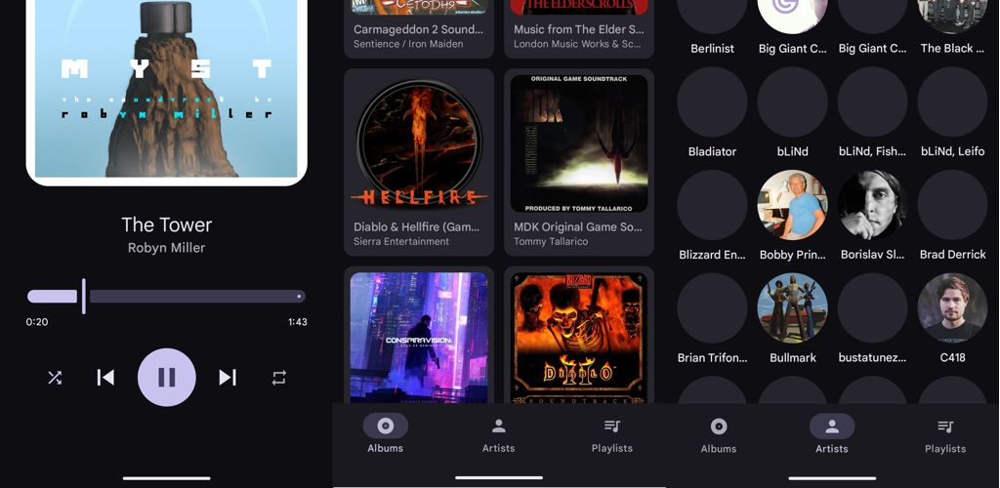
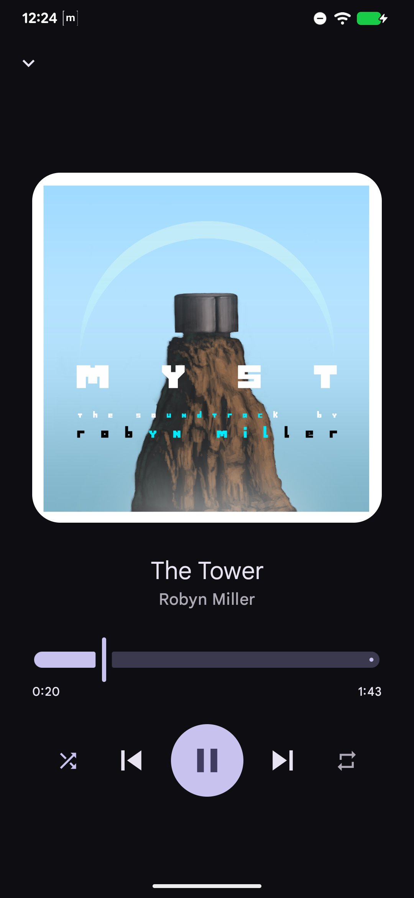
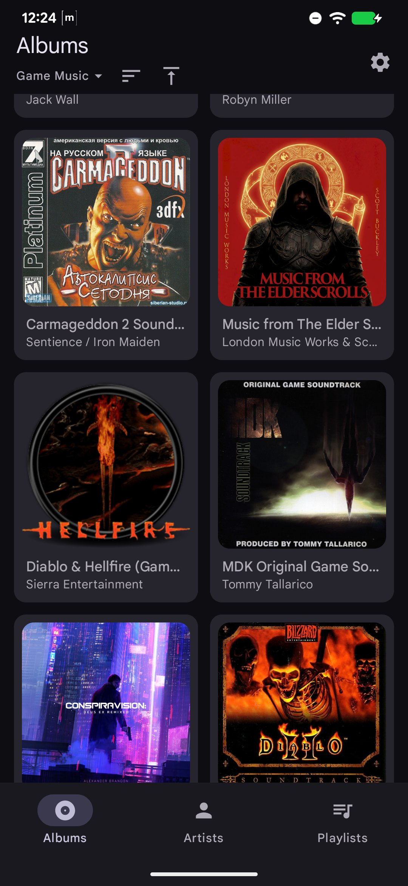
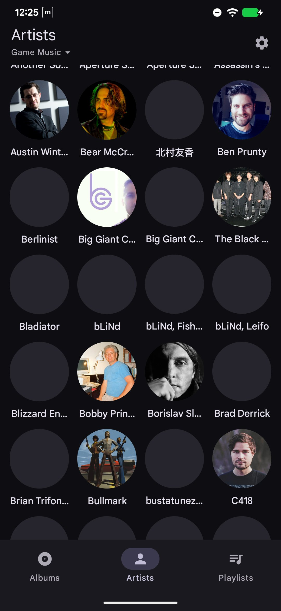
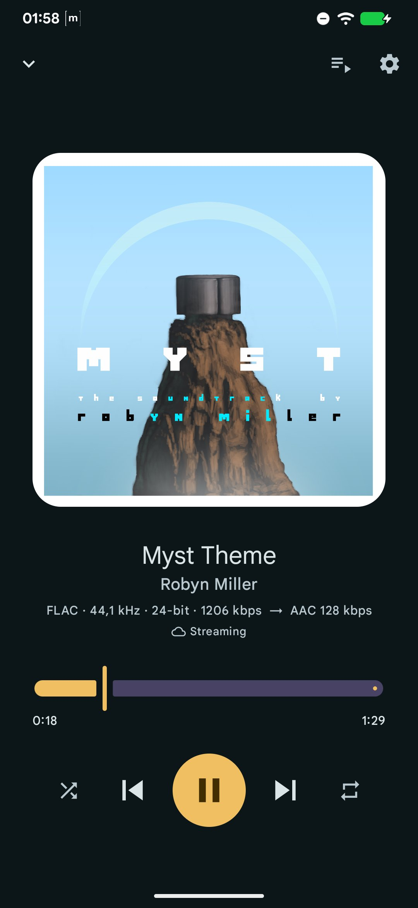

# JellyMusic

A music-only Android client for [Jellyfin](https://jellyfin.org), built with Material 3 Expressive.
Browse your libraries, stream or download for offline, and play on your phone, tablet, or in the car —
with a now-playing screen that recolors itself to the album art.

  
  
  
  

## Features

**Connect**
- LAN server discovery, manual address, username/password, and Quick Connect
- Re-authenticates automatically when the server rejects a token

**Browse**
- Albums (paged, sortable), artists and playlists; pick a single library or "All music"
- Search across songs, albums, artists and playlists
- Album view with collapsing cover art, per-disc grouping, and play / shuffle

**Playback**
- Background playback with lock-screen / notification controls and **Android Auto**
- Shuffle, repeat, and an "Up Next" queue you can reorder into and remove from
- The queue survives the app being killed, and resumes from a Bluetooth / media-button press
- Reports play counts, resume points and "now playing" back to your Jellyfin server

**Now playing**
- Per-album dynamic color theme derived from the cover art (toggle in Settings)
- Shows the file quality (codec / rate / depth / bitrate) and whether it's streaming or transcoded
- Marks whether the track is streaming or playing from a local download

**Streaming & transcoding**
- Direct play, or server-side transcode to Opus / AAC / MP3 with a max-bitrate cap

**Offline**
- Download individual tracks or whole albums (original or transcoded), with progress bars
- Downloads run in the background and survive the app being killed (WorkManager)
- Album art is cached, so covers show offline
- Browse and play your downloads, artists, playlists and albums with no connection
- A Downloads manager with storage usage and per-item removal

## Built with

- **Kotlin**, **Jetpack Compose**, **Material 3 Expressive** (light/dark + dynamic color)
- **Media3** (ExoPlayer + `MediaLibraryService`) for playback and Android Auto
- **jellyfin-sdk-kotlin** for the server API, auth and transcoding endpoints
- **Hilt** (DI), **Room** (browse cache + downloads), **DataStore** (settings + queue), **WorkManager** (downloads)
- **Paging 3**, **Navigation Compose**, Coroutines / Flow
- **Coil** for artwork; **MaterialKolor** + **Palette** for per-album color extraction
- **detekt** for static analysis; JUnit / MockK / Turbine for unit tests
- Targets Android 17 (compile/target SDK 37), minSdk 29

## Building

Standard Gradle Android project — `./gradlew assembleDebug`. Static analysis: `bash scripts/detekt.sh`.
